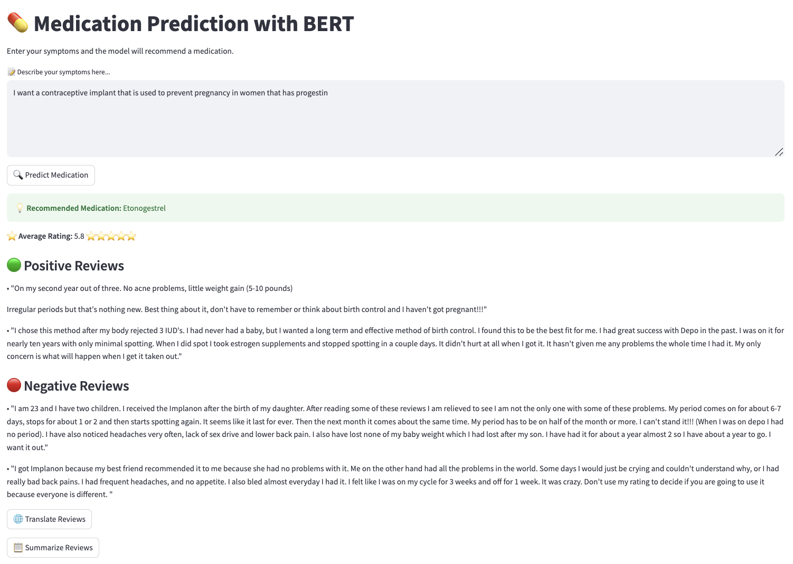
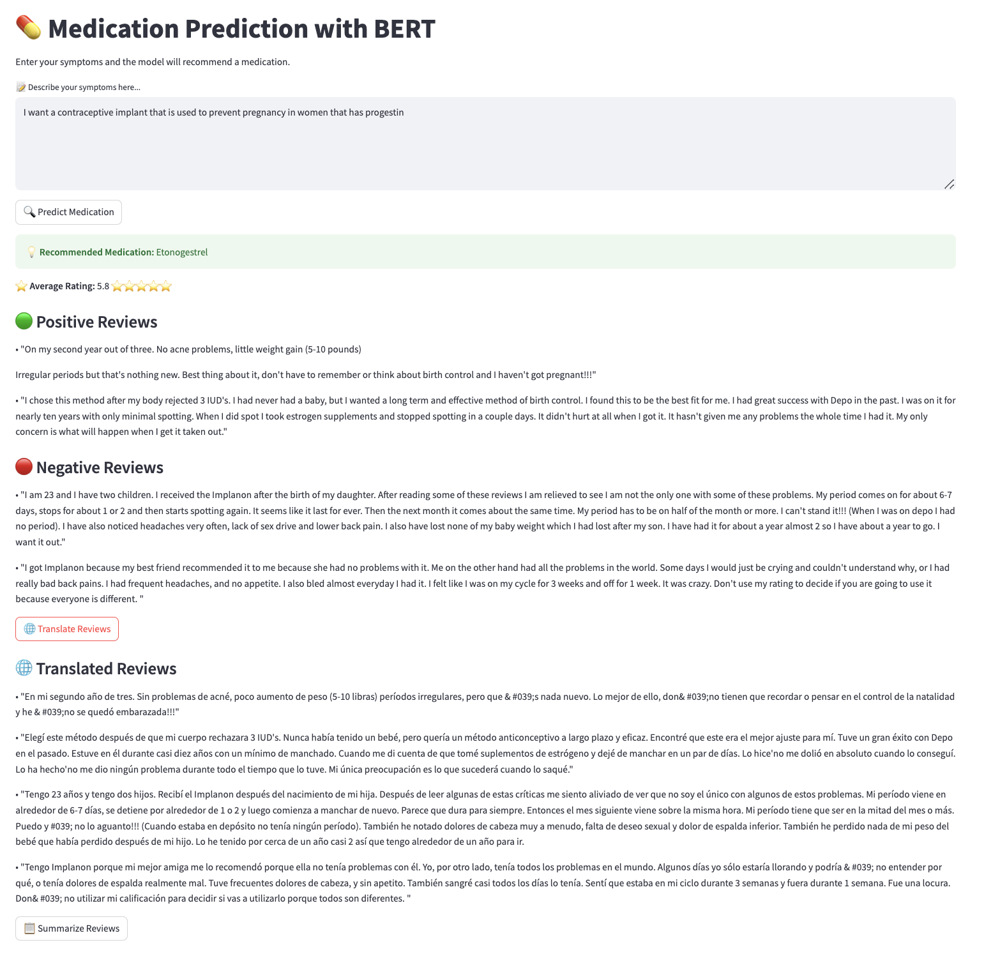
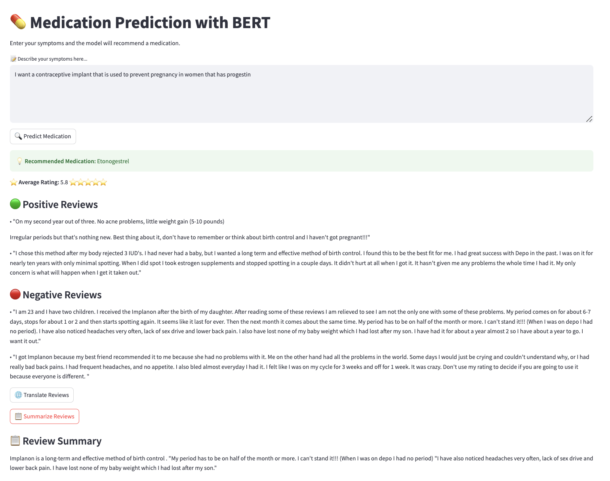

# **Unstructured Data course**

# **Text project**

## **Medication Recommender**

This project leverages Natural Language Processing (NLP) and Deep Learning which will allow us to extract relevant information from the comments and assign appropriate classifications. Through this approach, we seek to facilitate medical decision making, optimize treatments and improve patients' experience with prescribed medications.

This project was undertaken as part of the Unstructured Data course within the Big Data Master's Degree program at Comillas ICAI University.

The team responsible for the project includes:

| Name                    | Email                           |
| ----------------------- | ------------------------------- |
| Marta Álvarez Fernández | 202402675@alu.comillas.edu      |
| Leticia Cólgan Valero   | leticiacologan@alu.comillas.edu |
| Ana Vera Peña           | 202416868@alu.comillas.edu      |

## **Overview**

Our project aims to develop an intelligent system capable of recommending the most appropriate medication based on a patient's described symptoms. We leverage a rich dataset from Kaggle [(https://www.kaggle.com/datasets/engsaiedali/drugscomtrain-raw)], which contains over 160,000 patient reviews, including drug names, conditions, ratings, and personal experiences.

We apply Natural Language Processing (NLP) and Machine Learning techniques, focusing especially on transfer learning using pre-trained BERT-based models such as Bio_ClinicalBERT. This allows our system to understand complex medical descriptions and map them to effective treatments.

## **Goals**

- Predict the most appropriate drug based on natural language input.
- Display key insights:
  1. Predicted medication name
  2. Average patient rating
  3. Example positive and negative reviews
  4. Optional summary and translation of reviews

## **Techniques Explored**

- Text cleaning and tokenization
- Label encoding of categorical variables (e.g., drug names)
- Transfer learning with Bio_ClinicalBERT
- Multi-class classification using Transformers
- Evaluation with accuracy, confusion matrix, and error analysis

## **Final Product**

Users can interact with a clean web interface built using Streamlit. The app allows users to:

- Input symptoms
- View drug predictions and relevant insights
- Translate reviews (English → Spanish)
- Generate summaries of user experiences

### Example: Medication Recommendation

### Example: Review Translation

### Example: Summary Output

This application has the potential to support clinical decisions and help users better understand treatment options based on similar patient experiences. It bridges the gap between unstructured patient feedback and actionable medical insights through modern NLP.
